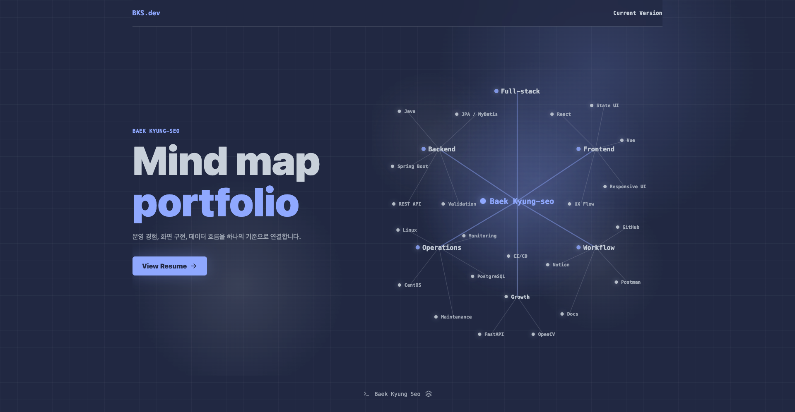

# Web Resume Portfolio

> React와 Vite로 제작한 개인 웹 이력서 포트폴리오입니다. 기술 스택, 경력, 프로젝트, 학습 기록, 이력서 다운로드까지 한 화면 흐름으로 확인할 수 있도록 구성했습니다.



## 데모와 링크

- GitHub: [baekks/Web_Resume_Portfolio](https://github.com/baekks/Web_Resume_Portfolio)
- Notion: [Java Spring Vue](https://app.notion.com/p/Java-Spring-Vue-37e3bc0ba132817fb4ead54f94122da8?source=copy_link)
- Resume: [baek-kyung-seo-resume.hwp](public/assets/baek-kyung-seo-resume.hwp)
- 로컬 실행 주소: `http://127.0.0.1:5173/`

## 프로젝트 소개

이 프로젝트는 백경서의 개발 경험과 성장 방향을 보여주기 위한 웹 기반 이력서입니다.

단순히 이력과 프로젝트를 나열하는 대신, 메인 화면에서 `Full-stack`, `Backend`, `Frontend`, `Operations`, `Workflow`, `Growth` 키워드를 네트워크 연결망 형태로 시각화했습니다. 각 노드는 관련 기술과 경험을 나타내며, 노드에 마우스를 올리거나 클릭하면 연결된 노드와 설명이 강조됩니다.

## 주요 기능

- 네트워크 그래프 기반 메인 인터랙션
- 노드 hover, focus, click 시 관련 연결선 강조
- 메인 화면에서 스크롤, 터치 스와이프, 키보드 입력으로 이력서 본문 진입
- About, Skills, Career, Projects, Contact 섹션 구성
- Career 섹션의 학력사항, 교육사항, 경력사항 분리
- 개인, 팀, 실무 프로젝트 필터링
- 프로젝트별 이미지, 기술 태그, 요약, 외부 링크 제공
- Contact 섹션 2x2 버튼 배치
- GitHub, Notion, Email, Resume 다운로드 연결
- 반응형 레이아웃과 접근 가능한 키보드 진입 흐름

## 화면 구성

| 섹션 | 설명 |
| ---- | ---- |
| Main | 네트워크 연결망 형태로 핵심 역량과 기술 흐름을 보여주는 첫 화면 |
| About | 개발자 소개와 방향성 |
| Skills | 언어, 프론트엔드, 백엔드, 데이터베이스, 인프라, 협업 도구 정리 |
| Career | 학력사항, 교육사항, 경력사항을 분리한 이력 구성 |
| Projects | 개인, 팀, 실무 프로젝트 카드와 필터 |
| Contact | GitHub, Notion, Email, Resume 버튼 제공 |

## 기술 스택과 선택 이유

| 기술 | 사용 이유 |
| ---- | -------- |
| React | 섹션별 UI를 컴포넌트로 분리하고 노드 선택 상태를 관리하기 위해 사용했습니다. |
| Vite | 빠른 개발 서버와 단순한 빌드 환경을 구성하기 위해 사용했습니다. |
| JavaScript | 포트폴리오 데이터, 필터, 네트워크 그래프 상태를 가볍게 다루기 위해 사용했습니다. |
| CSS3 | 네트워크 그래프, 반응형 레이아웃, 섹션별 시각 스타일을 직접 제어하기 위해 사용했습니다. |
| lucide-react | Contact 버튼, 섹션 아이콘, CTA에 일관된 아이콘 스타일을 적용하기 위해 사용했습니다. |

## 핵심 구현

### 네트워크 그래프 메인

메인 화면은 고정 좌표 기반의 네트워크 그래프입니다. 중심 노드 `Baek Kyung-seo`에서 주요 역량 노드가 연결되고, 기술 노드끼리는 브릿지 연결선을 추가해 단순 트리보다 연결망처럼 보이도록 구성했습니다.

- 노드 수: 28개
- 연결선 수: 46개
- 브릿지 연결선: 18개
- 활성 노드에 따라 관련 노드와 연결선 강조
- 설명 패널은 선택된 노드 또는 상위 역량 설명 표시

### 프로젝트 데이터 관리

프로젝트, 기술 스택, 경력, 네트워크 노드 데이터는 `src/data/portfolioData.js`에 모아 관리합니다. Career 데이터에는 `academic`, `education`, `career` 분류값을 두어 학력사항, 교육사항, 경력사항을 구분해 렌더링합니다.

### Career 구성

Career 섹션은 아래 순서로 정리했습니다.

```text
학력사항
교육사항
경력사항
```

학력은 정규 학력, 교육은 개발 교육 과정, 경력은 실무와 인턴십 이력을 기준으로 분리했습니다.

### Contact 링크

Contact 섹션은 아래 순서로 배치했습니다.

```text
GitHub / Notion
Email  / Resume
```

Resume 버튼은 `public/assets/baek-kyung-seo-resume.hwp` 파일을 다운로드합니다.

## 프로젝트 구조

```text
Web_Resume_Portfolio/
├─ README.md
├─ index.html
├─ package.json
├─ public/
│  └─ assets/
│     ├─ baek-kyung-seo-resume.hwp
│     └─ *.png
└─ src/
   ├─ App.jsx
   ├─ Version3.jsx
   ├─ components/
   │  ├─ About.jsx
   │  ├─ Career.jsx
   │  ├─ Contact.jsx
   │  ├─ Footer.jsx
   │  ├─ Header.jsx
   │  ├─ Main.jsx
   │  ├─ Projects.jsx
   │  └─ Skills.jsx
   ├─ data/
   │  └─ portfolioData.js
   ├─ main.jsx
   ├─ styles.css
   └─ version2.css
```

## 실행 방법

### 1. 저장소 클론

```bash
git clone https://github.com/baekks/Web_Resume_Portfolio.git
cd Web_Resume_Portfolio
```

### 2. 의존성 설치

```bash
npm install
```

### 3. 개발 서버 실행

```bash
npm run dev
```

브라우저에서 `http://127.0.0.1:5173/` 주소로 접속합니다.

### 4. 프로덕션 빌드

```bash
npm run build
```

빌드 결과물은 `dist/` 폴더에 생성됩니다.

## 구현 과정과 의사결정

- 저장소 루트에서 바로 실행할 수 있도록 프로젝트 위치를 정리했습니다.
- 메인 화면은 마인드맵에서 출발했지만, 기술 간 관계가 더 잘 드러나도록 네트워크 연결망 스타일로 개선했습니다.
- 포스 디렉티드 그래프도 검토했지만, 현재 포트폴리오에서는 의도한 역량 배치를 명확하게 보여주는 고정 좌표 네트워크가 더 적합하다고 판단했습니다.
- Career 섹션은 피드백을 반영해 학력사항, 교육사항, 경력사항으로 분리했습니다.
- Contact 섹션은 채용 담당자가 바로 이동하거나 다운로드할 수 있도록 GitHub, Notion, Email, Resume 네 가지 동작으로 정리했습니다.
- 빌드 결과물과 의존성 폴더는 `.gitignore`로 제외하고, 소스와 공개 에셋만 관리합니다.

## 검증

- `npm run build`로 프로덕션 빌드 확인
- 로컬 Vite 서버에서 메인 진입, 네트워크 노드 클릭, Contact 링크 렌더링 확인
- Career 섹션의 학력사항, 교육사항, 경력사항 그룹 렌더링 확인
- Notion 외부 링크 연결 확인
- Resume 파일 다운로드 경로 연결 확인

## 개선 계획

- 배포 URL 추가
- Resume PDF 버전 추가 검토
- 프로젝트별 상세 모달 또는 상세 페이지 추가
- Lighthouse 기준 성능, 접근성, SEO 점검
- 네트워크 그래프 모바일 화면 가독성 추가 개선

## 연락처

- GitHub: [baekks](https://github.com/baekks)
- Notion: [Java Spring Vue](https://app.notion.com/p/Java-Spring-Vue-37e3bc0ba132817fb4ead54f94122da8?source=copy_link)
- Email: [baekks93@gmail.com](mailto:baekks93@gmail.com)
